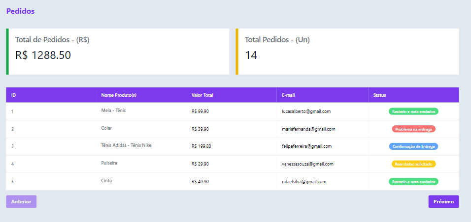

# Dashboard - Pedidos

### Pedidos

Esse dashboard tem como objetivo mostrar o total de pedidos em reais (R$) e em unidades (un), em dois cards na parte superior da tela, logo abaixo, terá uma tabela listando os pedidos onde cada coluna irá mostrar alguns dados iniciais, tais como, ID, Nome dos produtos, Valor total dos produtos, E-mail do cliente, e status do pedido, cada status terá uma cor para fácil identificação.



### 🚀Começando

Essas instruções permitirão que você obtenha uma cópia do projeto em operação na sua máquina local para fins de desenvolvimento e teste.

### 🔧 Instalação

```bash
git clone https://github.com/anderssoncosta/dashboard-pedidos
```

Para rodar o projeto, faça o seguinte comando:

```bash
cd dashboard-pedidos
```

Após isso, será importante instalar todas as dependências:

```bash
npm install
```

Após isso, o projeto estará instalado, agora precisamos apenas rodar:

```bash
npm run start
```

## 🛠️ Contruído com

- React
- ShadcnUi
- Styled Components
